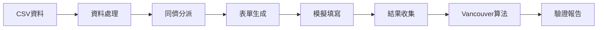

# 去中心化期中考互評系統 | Decentralized Midterm Peer Evaluation System

[](https://www.python.org/)
[](https://github.com/lucadealfaro/vancouver)

> 一個基於 Vancouver 演算法的智慧互評系統，提供從原始資料處理到最終結果分析的完整自動化解決方案。
> 
> *An intelligent peer evaluation system powered by the Vancouver algorithm, providing complete automated solutions from raw data processing to final result analysis.*

## 快速開始 | Quick Start

### 安裝與設定 | Installation & Setup

1. **克隆專案 | Clone Repository**
   ```bash
   git clone https://github.com/Showyuan/decentralized-midterm-peer-evaluation.git
   cd decentralized-midterm-peer-evaluation
   ```

2. **建立虛擬環境 | Create Virtual Environment** *(建議 | Recommended)*
   ```bash
   python -m venv venv
   # Windows
   venv\Scripts\activate
   # macOS/Linux  
   source venv/bin/activate
   ```

3. **安裝相依套件 | Install Dependencies**
   ```bash
   pip install -r requirements.txt
   ```

4. **系統驗證 | System Verification**
   ```bash
   python peer_evaluation/main.py --status
   ```
---

## 使用指南 | User Guide

### 推薦使用方式 | Recommended Usage Patterns

#### 1. **一鍵完整執行** | One-Click Complete Execution

適用於：*初次使用、完整測試流程*  
*Best for: First-time use, complete testing workflow*

```bash
python peer_evaluation/main.py --workflow
```

> **執行流程** | **Execution Process**:  
> 資料處理 → 同儕分派 → 表單生成 → 模擬填寫 → 結果收集 → Vancouver 算法 → 驗證報告  
> *Data Processing → Peer Assignment → Form Generation → Simulation → Result Collection → Vancouver Algorithm → Verification Report*

#### 2. **分步驟執行** | Step-by-Step Execution

```bash
# 步驟 1: 處理 CSV 資料 | Step 1: Process CSV data
python peer_evaluation/main.py --data-only --csv "docs/Midterm Survey Student Analysis Report.csv"

# 步驟 2: 生成同儕分派 | Step 2: Generate peer assignments  
python peer_evaluation/main.py --assign-only --json workflow_results/1_csv_analysis/midterm_data.json

# 步驟 3: 生成評分表單 | Step 3: Generate evaluation forms
python peer_evaluation/main.py --forms-only --assignment workflow_results/2_peer_assignment/peer_assignments.json

```

#### 3. **配置管理** | Configuration Management

```bash
# 查看可用配置 | List available configurations
python peer_evaluation/main.py --list-presets

# 使用標準配置 | Use standard configuration
python peer_evaluation/main.py --workflow --preset standard

# 查看系統狀態 | View system status  
python peer_evaluation/main.py --status
```

---

## 工作流程與輸出 | Workflow & Output Structure

### 七階段完整流程 | Seven-Stage Complete Process



### 輸出目錄結構 | Output Directory Structure

執行完整工作流程後，系統會在 `workflow_results/` 目錄下生成以下結構化輸出：

*After running the complete workflow, the system generates the following structured output in the `workflow_results/` directory:*

```
workflow_results/
├── 1_csv_analysis/              # 第一階段：CSV 資料分析 | Stage 1: CSV Data Analysis
│   └── midterm_data.json        # 結構化學生考試資料 | Structured student exam data
│
├── 2_peer_assignment/           # 第二階段：同儕分派 | Stage 2: Peer Assignment  
│   └── peer_assignments.json    # 學生評分配對表 | Student evaluation pairing table
│
├── 3_form_generation/           # 第三階段：表單生成 | Stage 3: Form Generation
│   └── evaluation_forms/        # 個人化 HTML 評分表單 | Personalized HTML evaluation forms
│
├── 4_form_simulation/           # 第四階段：表單模擬 | Stage 4: Form Simulation
│   └── simulated_responses/     # 模擬學生評分回應 | Simulated student evaluation responses
│
├── 5_result_collection/         # 第五階段：結果收集 | Stage 5: Result Collection
│   └── collected_results.json   # 整合所有評分資料 | Integrated evaluation data
│
├── 6_vancouver_processing/      # 第六階段：Vancouver 處理 | Stage 6: Vancouver Processing
│   └── vancouver_results.json   # 演算法標準化結果 | Algorithm standardized results
│
└── 7_verification_report/       # 第七階段：驗證報告 | Stage 7: Verification Report
    └── verification_report.xlsx # Excel 格式完整報告 | Complete Excel format report
```

---

## 資料格式說明 | Data Format Specifications

### 輸入資料格式 | Input Data Format

| 檔案類型 | 路徑 | 說明 | Description |
|---------|------|------|-------------|
| **學生考試資料** | `docs/Midterm Survey Student Analysis Report.csv` | NTU COOL 匯出的 CSV 格式 | CSV format exported from NTU COOL |

**支援的 CSV 欄位** | **Supported CSV Fields**:
- 學生姓名、學號、考試成績等基本資訊
- *Student names, IDs, exam scores, and other basic information*

### 輸出資料說明 | Output Data Description

#### 各階段輸出詳解 | Stage Output Details

| 階段 | 檔案 | 內容說明 | Content Description |
|------|------|----------|---------------------|
| **資料處理** | `midterm_data.json` | 標準化的學生考試資料 | Standardized student exam data |
| **同儕分派** | `peer_assignments.json` | 每位學生的評分對象清單 | List of evaluation targets for each student |
| **表單生成** | `evaluation_forms/*.html` | 個人化的網頁評分表單 | Personalized web evaluation forms |
| **模擬填寫** | `simulated_responses/*` | 系統生成的模擬評分資料 | System-generated simulated evaluation data |
| **結果收集** | `collected_results.json` | 整合所有評分者的原始評分 | Integrated raw scores from all evaluators |
| **Vancouver** | `vancouver_results.json` | 經演算法處理的最終評分 | Final scores processed by the algorithm |
| **驗證報告** | `verification_report.xlsx` | 統計分析與品質檢核報告 | Statistical analysis and quality assurance report |

### 配置參數說明 | Configuration Parameters

#### Vancouver 演算法參數 | Vancouver Algorithm Parameters

```python
VANCOUVER_CONFIG = {
    'vG_value': 8.0,          # 群體一致性目標值 | Group consistency target value
    'tolerance': 0.1,         # 收斂容忍度 | Convergence tolerance  
    'iterations': 25,         # 最大迭代次數 | Maximum iterations
    'min_evaluators': 4       # 最少評分者數量 | Minimum number of evaluators
}
```
---

## 專案架構 | Project Architecture

### 目錄結構 | Directory Structure

```
vancouver/
├── peer_evaluation/           # 核心測試系統 | Core Testing System
│   ├── main.py                # 系統主控制器 | Main System Controller
│   ├── config_unified.py      # 統一配置檔 | Unified Configuration
│   ├── data_processor.py      # 資料處理引擎 | Data Processing Engine
│   ├── assignment_engine.py   # 分派演算法 | Assignment Algorithm
│   ├── form_generator.py      # 表單生成器 | Form Generator
│   ├── form_simulator.py      # 表單模擬器 | Form Simulator
│   ├── result_collector_simple.py # 結果收集器 | Result Collector
│   ├── vancouver_processor.py # Vancouver 處理器 | Vancouver Processor
│   └── verification_report.py # 驗證報告器 | Verification Reporter
│
├── core/                     # Vancouver 演算法核心 | Vancouver Algorithm Core
│   ├── vancouver.py          # 核心演算法實作 | Core algorithm implementation
│   └── n_theoretical_foundations.py # 數學模型 | Mathematical models
│
├── analysis/                 # 分析工具模組 | Analysis Tools Module
│   ├── vg_analysis.py        # 統計分析工具 | Statistical analysis tools
│   └── basic_precision_analysis.py # 精度分析工具 | Precision analysis tools
│
├── docs/                     # 文檔與範例資料 | Documentation & Sample Data
│   └── Midterm Survey Student Analysis Report.csv
│
├── workflow_results/         # 工作流程輸出 | Workflow Outputs
│   └── (執行後自動生成 | Auto-generated after execution)
│
├── requirements.txt          # 相依套件清單 | Dependencies List
└── README.md                 # 專案說明文件 | Project Documentation
```

## 進階使用 | Advanced Usage

### 自訂配置 | Custom Configuration

編輯 `peer_evaluation/config_unified.py` 來調整系統行為：

*Edit `peer_evaluation/config_unified.py` to adjust system behavior:*

```python
# 檔案路徑設定 | File Path Settings
CSV_PATH = "path/to/your/data.csv"
OUTPUT_BASE_DIR = "custom_results/"

# Vancouver 演算法調校 | Vancouver Algorithm Tuning
VANCOUVER_CONFIG = {
    'vG_value': 8.0,           # 群體一致性目標 | Group consistency target
    'tolerance': 0.1,          # 收斂精度 | Convergence precision
    'iterations': 100,         # 迭代上限 | Iteration limit
    'damping_factor': 0.7      # 阻尼係數 | Damping factor
}